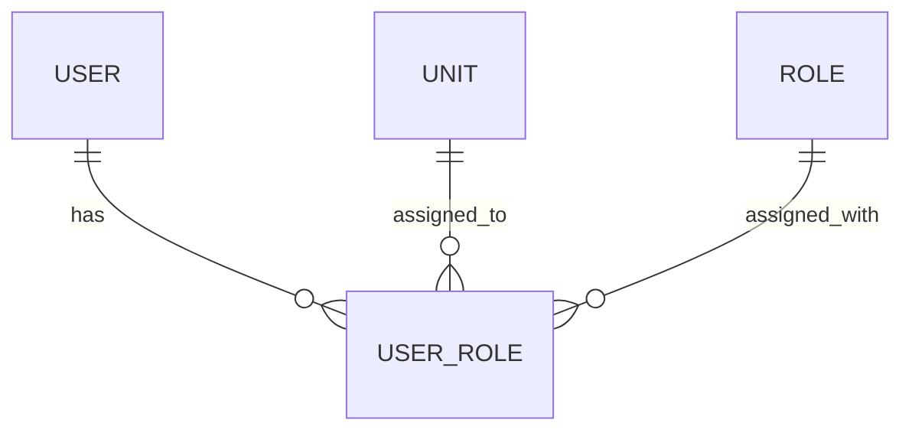

# cancer-registry

## Table of Contents
- [Description](#description)
- [Features](#features-wip)
- [Data model](#data-model)
- [Installation](#installation)
- [Usage](#usage)

## Description

This is an entirely _thought_ project for a registry system, here a cancer registry. 

It per now enables the admin part, i.e., managing users, units and their roles.

In the (thought) future it could become a system for people working in cancer research, or other things for that matter.

## Features (WIP)
 - Feature 1
 - Feature 2
 - Feature 3

## Data model



## Installation

```bash
# Clone the repository
git clone https://github.com/heisand/cancer-registry
```

### Backend

### Frontend

```bash
# Navigate to the frontend directory
cd cancer-registry/frontend

# Install dependencies
npm install
```

## Usage

### Backend

```bash
# Navigate to the backend directory
cd cancer-registry/backend

# Run
./gradlew bootRun
```

### Frontend

```bash
# Navigate to the frontend directory
cd cancer-registry/frontend

# Run
npm run dev
```