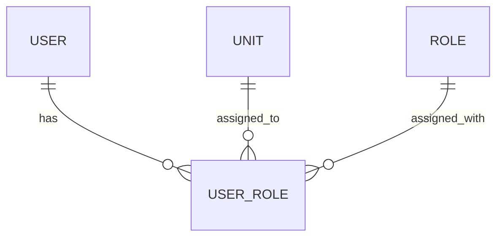

# cancer-registry

## Table of Contents
  - [Description](#description)
  - [Data model](#data-model)
  - [Installation](#installation)
    - [Backend](#backend)
    - [Frontend](#frontend)
  - [Usage](#usage)
    - [Backend](#backend-1)
    - [Frontend](#frontend-1)

## Description

This is an entirely _thought_ project for a registry system, here a user registry. 

It per now enables the admin part, i.e., managing users, units and their roles.

## Data model



## Installation

```bash
# Clone the repository
git clone https://github.com/heisand/cancer-registry
```

### Backend
 - JDK

   You need to have Java Development Kit (JDK) 17 or later installed.

   Install via [Homebrew](https://brew.sh/) or other package managers, e.g., `brew install openjdk@17`.

 - Gradle

   Install via [Homebrew](https://brew.sh/) or other package managers, e.g., `brew install gradle`.

### Frontend

```bash
# Navigate to the frontend directory
cd cancer-registry/frontend

# Install dependencies
npm install
```

## Usage

### Backend

```bash
# Navigate to the backend directory
cd cancer-registry/backend

# Run
./gradlew bootRun
```

### Frontend

```bash
# Navigate to the frontend directory
cd cancer-registry/frontend

# Run
npm run dev
```
